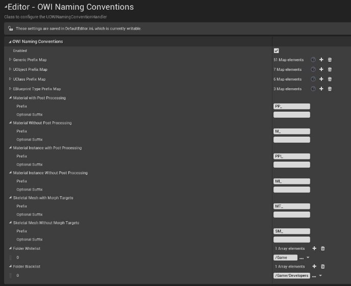
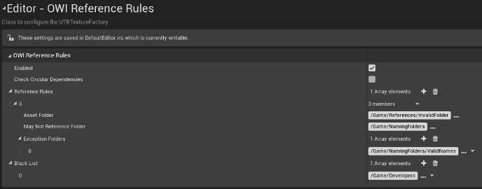
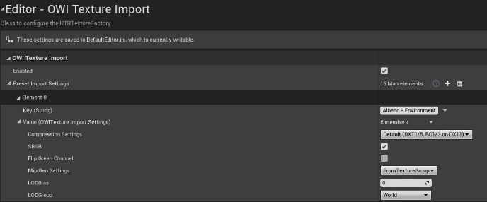
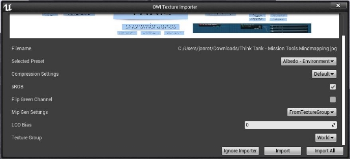

# Editor Tools

- [Installation](#installation)
- [Configuration](#Configuration)
- [Naming Conventions](#naming-conventions)
- [Reference Rules](#reference-rules)
- [Texture Import](#texture-import)

## Installation

Download the latest release and unzip the contents into the plugins folder of your project. To get started quickly you may copy the content of the DefaultEditor.ini into the DefaultEditor.ini of your project.

## Configuration

To configure the plugin go to “Edit”  “Project Settings”  And under “Editor” then choose either “OWI Naming Conventions”, “OWI Reference Rules” or “OWI Texture Import”. For details see the corresponding subsections.

## Naming Conventions

This tool is responsible to check if Assets are properly named. See this document for details.

In case an Asset does not meet the standard a error will appear when saving the Asset which includes how the Asset should be renamed.

If the tool is enabled it can be configured to have a match with every existing class available. Each entry has a Prefix and an optional Suffix. The check is being done in this order:

1. Material Instance (w/ w/out Post Processing)
1. Material (w/ w/out Post Processing)
1. Skeletal Mesh (w/ w/out Morph Targets)
1. EBlueprint Types
1. UObject
1. UClass
1. Generic
1. Back to 6 with ParentClass (recursive until highest class is reached)

For the Generic Map keep in mind that they include spaces, e.g. ULevelSequence is detected as “Level Sequence”.

## Reference Rules

This tool will check for References an Asset has when being saved. This allows for sanity checks, e.g. it is common practice that Assets that are supposed to end up in the final game should not reference anything inside the Developers folder or any esting folders.

If the tool is enabled it can be configured to check for Circular Dependencies (a Asset referencing itself within the reference chain) or rules for various folders can be implemented.

In the given example everything inside the “/Game/References/InvalidFolder” folder may not reference anything inside the “/Game /NamingFolders” with the exception of Assets in the “/Game/NamingFolders/ValidNames” folder.

Also the Blacklist can be used to exclude a whole folder to be referenced, in the example above nothing inside the “/Game/Developers” may be referenced.

## Texture Import

This tool allows to set certain preset settings when importing a texture into the project.

If the tool is enabled and at least 1 preset is set, a dialog will appear each time a Texture is imported:

On the top a preview of the Texture is being shown (note: this will NOT adjust in real-time depending on the settings you make below!) and the filepath is shown beneath.

Then you may select any of the presets you created following by the possibility to adjust that preset for this import (not adjusting the saved preset!).

If you want to skip the Importer either select “Ignore Importer” or close the Window using the X on top.

Using “Import” will import this single texture while “Import All” will apply this preset to all files of the same type (when importing multiple files).
