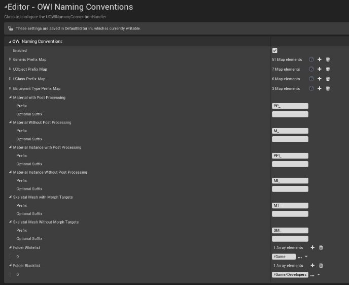

# Editor Enhancements
> Enhancements for UE4 to help enforce good working practices. 

This is an internal tool used at [Offworld Industries](https://www.offworldindustries.com/) we have decided to open source this project as it might be useful. This repository is a group of Unreal Engine 4 tools to help enforce and maintain good working practices. 

## Installation

Download the latest release from here and unzip it into the plugins folder of your project.
You may have to adjust the Unreal Engine version in the OWI_EditorEnhancements.uplugin file.

## Usage

In your project go to Edit -> Project Settings -> OWI Naming Conventions / OWI Reference Rules / OWI Texture Importer and edit the settings there.
To get started you may use the DefaultEditor.ini file from this project / the zip file (copy the contents into your DefaultEditor.ini).

Now everytime an Asset is saved it's naming convention and references will be checked and Unreal will complain in case there are any issues.
To manually trigger it right-click a file/folder and select "Validate Asset/Folder".

Also when importing a Texture (and at least 1 Preset exists) a dialog will appear to change the settings for the imported texture.

## Contributing

1. Fork it (<https://github.com/offworldindustries/ue4-plugin-editorenhancements/fork>)
2. Create your feature branch (`git checkout -b feature/fooBar`)
3. Commit your changes (`git commit -am 'Add some fooBar'`)
4. Push to the branch (`git push origin feature/fooBar`)
5. Create a new Pull Request